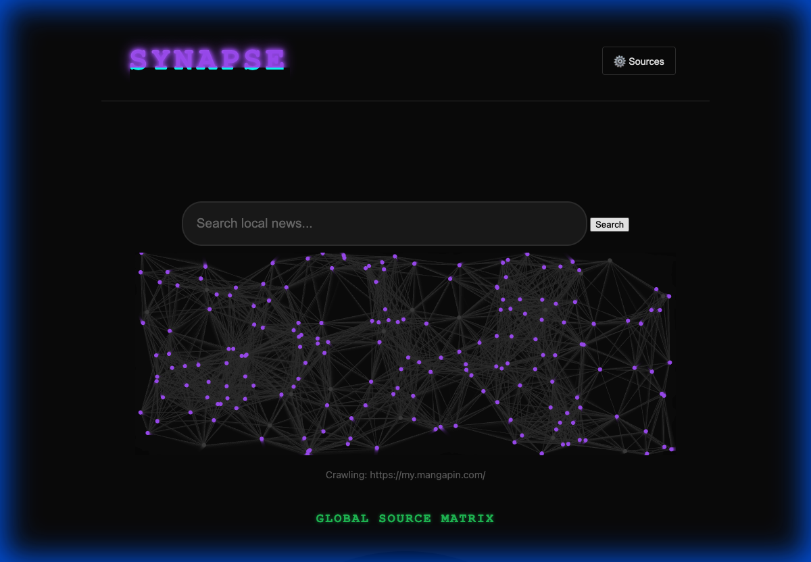
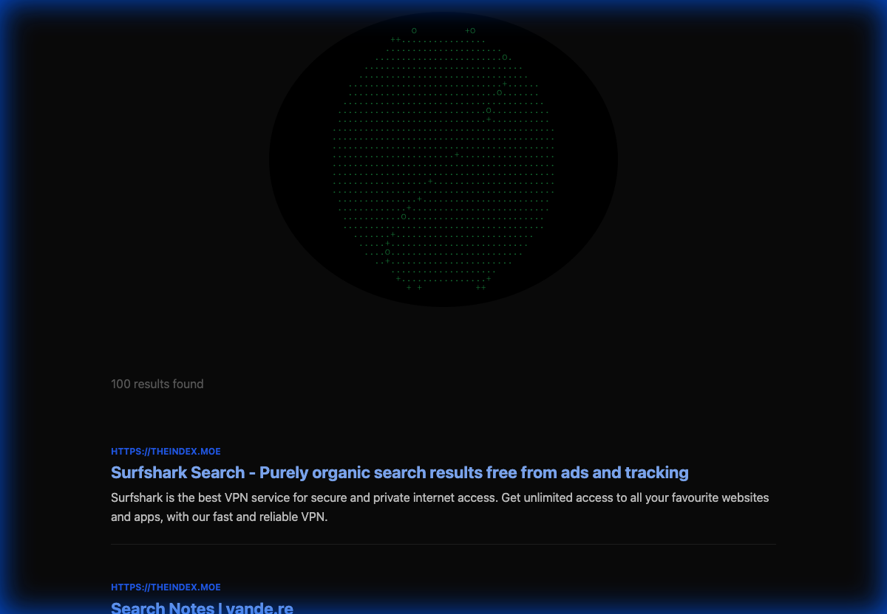
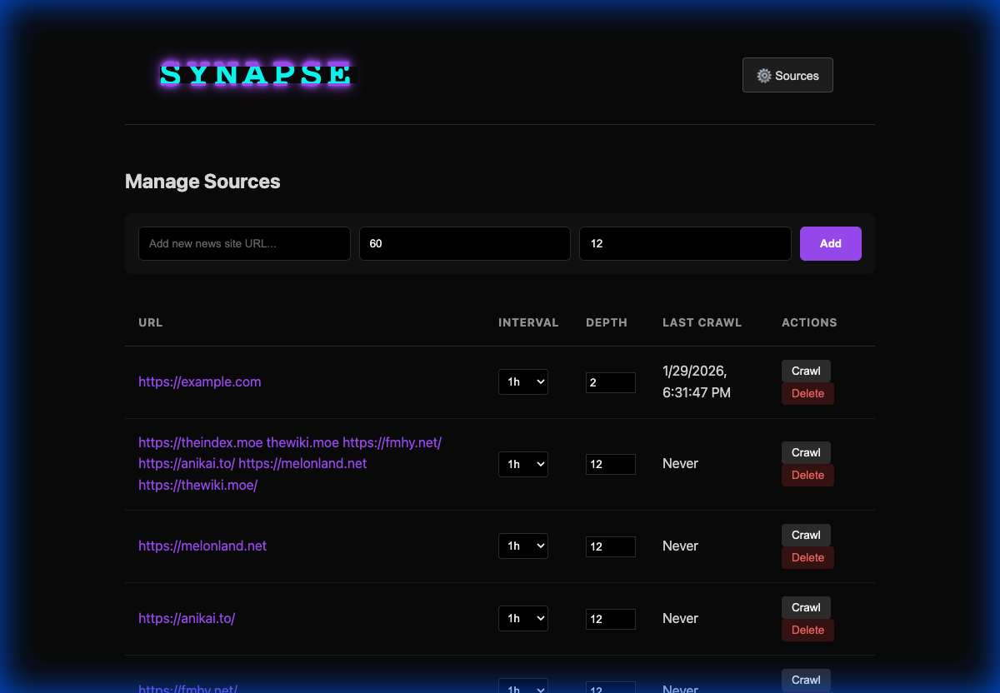

# Synapse Search

A powerful, local-first news search engine. Synapse Search allows you to aggregate, index, and search content from your favorite websites, completely local and privacy-focused.

This project is a demonstration and experiment created with **Google Antigravity** and **Gemini** to explore the feasibility of curating your own slice of the web—filtering out the noise of the modern internet to focus on high-quality, trusted sources.

## Features

-   **Intelligent Crawling**: Automatically crawls websites recursively up to a specified depth to build your search index.
-   **Content Extraction**: Uses Mozilla's Readability to extract meaningful content from clutter, keeping only the main article text.
-   **Full-Text Search**: Built-in SQLite FTS5 support for fast, efficient searching across all indexed articles.
-   **Visual Graph**: Explore connections between articles and sources in an interactive graph view.
-   **Real-time Updates**: Live crawling status and updates via Server-Sent Events (SSE).
-   **Local & Private**: All data is stored locally in a SQLite database (`news.db`).

## Screenshots


*The main search interface with live crawl visualizer.*


*Full-text search results with content snippets.*


*Manage your crawled sources and configure depth/intervals.*

## How It Works: Search Engine Architecture

Search engines, at their core, consist of three main components: a **Crawler**, an **Indexer**, and a **Query Engine**. Synapse Search implements a simplified but functional version of this architecture, operating similarly to distributed search projects like **YaCy**.

### 1. The Crawler (The "Spider")
Just like GoogleBot or YaCy's crawler, Synapse Search uses a "spider" program (`crawler.js`) to traverse the web.
-   **Seeding**: It starts with a list of "seed" URLs provided by the user (your curated sources).
-   **Fetching**: It retrieves the HTML content of these pages using `axios`, mimicking a web browser.
-   **Parsing**: It parses the HTML structure using `jsdom` and `cheerio`.
-   **Traversal**: It looks for hyperlinks (`<a>` tags) on the page. If a link points to a page within the same domain (or an allowed external link), it adds that URL to a queue.
-   **Recursion**: The process repeats for the new URLs, continuing up to a configured "depth" (e.g., 7 clicks deep). This allows it to map out an entire website from a single starting point.

**Why this matters**: By controlling the seeds and the depth, you effectively create a "walled garden" search engine. You aren't searching the *whole* web; you are searching *your* web—free from SEO spam and irrelevant content.

### 2. The Indexer (The "Brain")
Raw HTML is messy. To make it searchable, we must refine it.
-   **Extraction**: We use `@mozilla/readability` (the same technology behind Firefox's Reader Mode) to strip away ads, sidebars, navigation menus, and popups. This leaves only the core article text.
-   **Storage**: The cleaned text, title, and metadata are stored in a **SQLite** database.
-   **Indexing**: We use **SQLite's FTS5 (Full-Text Search 5)** extension. This creates an "inverted index"—a data structure that maps every word to the specific documents and positions where it appears. This is what allows the search to be instantaneous, even with thousands of articles.

### 3. The Query Engine
When you type a search term:
-   The engine queries the FTS5 index for documents matching the terms.
-   It uses a ranking algorithm (BM25 logic built into SQLite) to determine which articles are most relevant.
-   It retrieves the snippets and highlights the matching terms for display.

## Technical Stack & Packages

This project is built on **Node.js** and relies on a robust ecosystem of open-source packages:

### Core Logic
-   **express**: The web framework that powers the server, API endpoints, and serves the frontend.
-   **sqlite3**: The database driver. We use it in **WAL (Write-Ahead Logging)** mode to handle concurrent writes from the crawler while you are reading/searching.

### Crawling & Parsing
-   **axios**: A promise-based HTTP client used to fetch web pages. It handles the raw network requests.
-   **jsdom**: A pure JavaScript implementation of the DOM (Document Object Model). It allows Node.js to understand HTML just like a browser does.
-   **cheerio**: A fast implementation of jQuery for the server. We use it for quick selection and manipulation of HTML elements.
-   **@mozilla/readability**: The "secret sauce" for quality. It uses heuristics to determine what part of a page is the actual content, ensuring your search index is filled with signals, not noise.

## Installation & Usage

1.  **Prerequisites**: Ensure you have [Node.js](https://nodejs.org/) installed (v14+ recommended).
2.  **Install Dependencies**:
    ```bash
    npm install
    ```
3.  **Start the Server**:
    ```bash
    npm start
    ```
4.  **Access**: Open `http://localhost:3000` in your browser.

## About & License

This software is **local-first** and **free software**. You are free to use, distribute, modify, and experiment with it as you wish.

The goal of this experiment was to understand how search infrastructure is built and to prove that personal, high-quality search automation is accessible to everyone. By running your own crawler, you take back control of your information diet.
